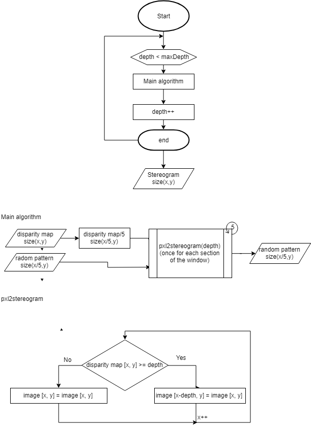

# Stereogram (Matlab implementation)
This is an implementation where a depth map image is taken as an input and a random dot stereogram is generated in a bitmap image in the output.

## Installation
- Clone the repository 
- Add the cloned repository and sub-folders to the matlab path
- Run the "stereogram.m"
- Load the disparity map
- Press "Start Stereogram" and select where do you want to save the image

## Algorithm and descpription of the function

 

